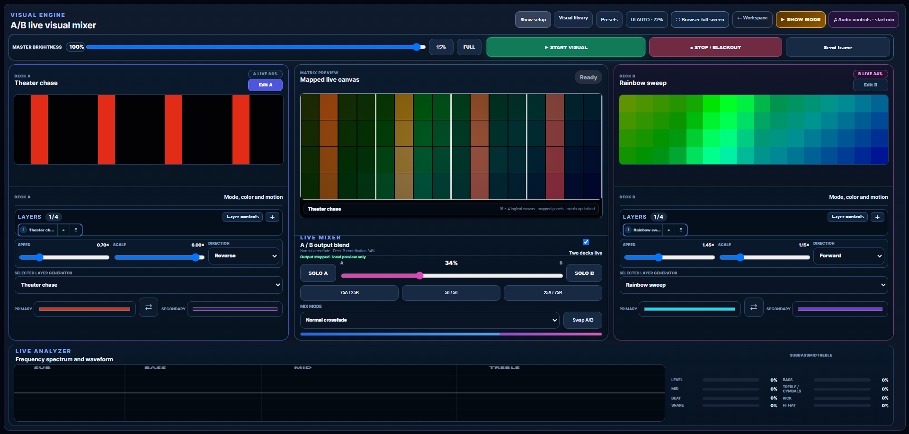

# LEDController.net

**LEDController.net** is a local browser-based visual controller for LED matrices, WLED installations, Art-Net devices, custom sculptures, stage pieces, and other addressable-lighting projects.

It combines controller discovery, physical pixel mapping, 135 visual generators, layered A/B mixing, audio-reactive processing, preset memory, show automation, and real-time DDP or Art-Net output in one workspace—without requiring a cloud service or an expensive media server.



## Current release

**v0.4.36**

- 135 visual generators
- Four layers per deck / eight total layer slots
- 12 layer blend modes, 12 modifiers, and nine masks
- Microphone, system-audio, FFT, beat, and transient analysis
- Advanced mixed-panel and custom physical pixel mapping
- Automatic disk-backed mapping recovery
- WLED/DDP and Art-Net discovery and output
- 229 automated tests passing
- Node.js 20 or newer

## Documentation

- **[Installation Guide](docs/INSTALLATION.md)** — install, launch, update, and network requirements
- **[Capabilities](docs/CAPABILITIES.md)** — complete overview of the visual, layer, audio, mapping, show, and output systems
- **[How-To Guide](docs/HOW-TO.md)** — discover hardware, build a map, test pixels, create looks, use audio, save presets, and run output

Additional technical references:

- [Pixel Mapper reference](README-PIXEL-MAPPER.md)
- [Mapping preview reference](README-MAPPING-PREVIEW.md)
- [Discovery reliability notes](README-DISCOVERY-RELIABILITY.md)
- [v0.4.36 release notes](RELEASE-NOTES-v0.4.36.md)
- [Changelog](CHANGELOG.md)

## Quick start

### Windows — no PowerShell required

1. Install the current LTS release from the **[official Node.js download page](https://nodejs.org/en/download)**.
2. Download the GitHub source ZIP and choose **Extract All**.
3. Open the extracted folder and double-click:

```text
start-ledcontroller.cmd
```

The launcher starts the local server and automatically opens:

```text
http://localhost:8087
```

Keep the command window open while LEDController.net is running. See the **[complete Installation Guide](docs/INSTALLATION.md)** for a click-by-click Windows setup, Command Prompt instructions, firewall setup, updating, and troubleshooting.

### macOS or Linux

```bash
npm start
```

Then open `http://localhost:8087`.

## Typical workflow

1. Use **Discover** to find a WLED or Art-Net controller.
2. Use **Map** to define the logical panel layout and physical wiring.
3. Verify the physical chain at low brightness and save the active mapping.
4. Open **Output Studio** and choose visuals for Deck A and Deck B.
5. Add layers, masks, modifiers, audio modulation, and A/B mixing.
6. Save the performance as a preset.
7. Start visual output at a safe brightness.

## Testing

Run the complete regression suite with:

```bash
npm test
```

## Project structure

```text
public/   Browser interface, visual engine, layers, audio, mapping, and styles
src/      Discovery, target, DNS, Art-Net, output, and disk-backed mapping modules
test/     Automated regression and feature tests
docs/     Installation, capabilities, how-to guides, and repository images
server.mjs
```

## Important safety note

Addressable LED installations can draw substantial current. Use correctly sized power supplies, fusing, wire gauges, grounding, data-level conversion, and power injection appropriate for the installation. Begin testing at low brightness.

## Current protocol scope

The current release supports **WLED/DDP** and **Art-Net** output. E1.31/sACN, OSC, serial output, video layers, text layers, and screen-capture layers are not included yet.

## License

No open-source license has been selected for this repository. Copyright © 2026 James Bahr. All rights reserved.
